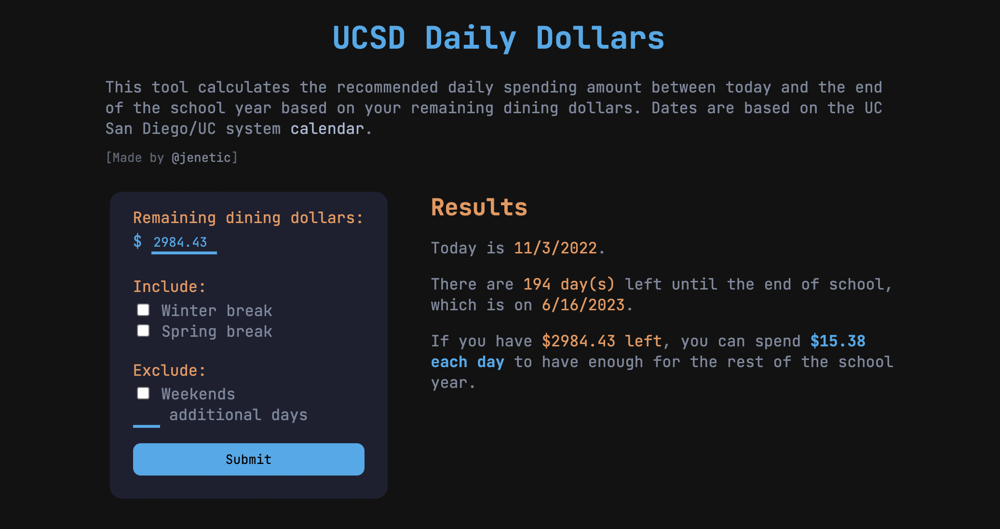

# Daily Dollars

Based on the amount of remaining dining dollars entered, this tool calculates the recommended daily spending amount between today and the end of the UC San Diego school year to have enough money based on user input of holiday breaks, weekends, and additional days.

## Demo
Try it out [here](https://jenetic.github.io/daily-dollars/)!

## Built With
This was built with JavaScript, HTML, and CSS.

